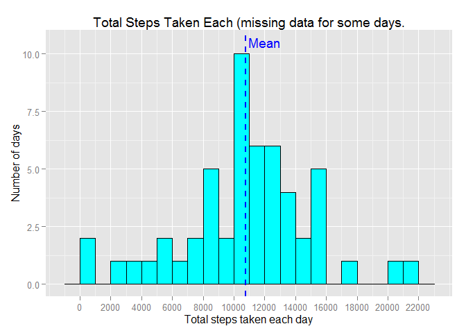
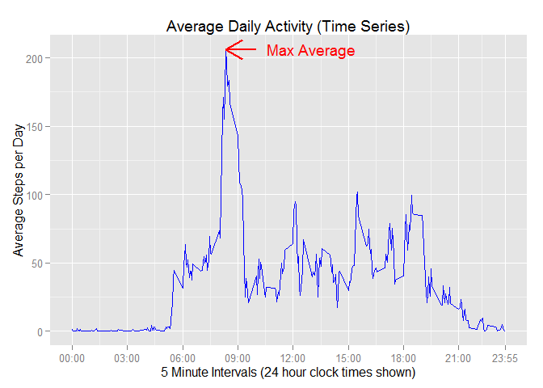

# Reproducible Research: Peer Assessment 1


## Loading and preprocessing the data

```r
library(ggplot2)
options(scipen = 1, digits = 2) # Need so numerics are rendered with a sensible format. 

# Get the Data File
dataFileName = "activity.csv"
if (!file.exists(dataFileName)) {
    zipFileName = "activity.zip"
    unzip(zipFileName)
}  

# Load the file into memory
data <- read.csv(dataFileName)
data$date <- as.Date(as.character(data$date), "%Y-%m-%d")

# Calculate the total number of steps taken per day.
totalStepsPerDayNA <- with(data[!is.na(data$steps),],tapply(steps,date,sum))                     
```

## What is mean total number of steps taken per day?

The total number of steps per day could only be calculated for days that step data was collected for. Step data was not collected for every day in the sample - see later question for further analysis of missing values. 

The histogram below summarises the total steps taken each day and the mean is also depicted by the blue dashed vertical line. 


```r
ggplot(NULL, aes(x=totalStepsPerDayNA)) + 
    geom_histogram(binwidth=1000, colour="black", fill="cyan") +
    geom_vline(aes(xintercept=mean(totalStepsPerDayNA)), color="blue", linetype="dashed", size=1) +
    xlab("Total steps taken each day") + ylab("Number of days") +
    ggtitle("Total Steps with Missing Values") +
    scale_x_continuous(breaks=seq(0,22000,by=2000))
```

 


The **mean** number of steps for each day is 10766.19 and the **median** is 10765.  

## What is the average daily activity pattern?

The graph below depicts the average activity levels (steps) as captured at 5 minute intervals through out each day in the study period. 


```r
meanStepsPerInterval <- with(data[!is.na(data$steps),],tapply(steps,interval,mean))
uniqueIntervals = as.numeric(names(meanStepsPerInterval))

categoryIndexOfMaxAverage = names(which( meanStepsPerInterval == max(meanStepsPerInterval)))
maxAverageSteps =  meanStepsPerInterval[categoryIndexOfMaxAverage]

ggplot(NULL,aes(x=uniqueIntervals,y=meanStepsPerInterval)) + 
    geom_line(color="blue") + 
    xlab("5 Minute Intervals (24 hour clock times shown)") + 
    ylab("Average Steps per Day") +
    ggtitle("Average Daily Activity (Time Series)") + 
    scale_x_continuous(breaks=c(0,300,600,900,1200,1500,1800,2100,2355),
                       labels=c("00:00","03:00","06:00","09:00","12:00","15:00","18:00","21:00","23:55"))
```

 


The maximum average step activity occured at 5 minute interval: 835 and the average was 206.17.

## Imputing missing values


```r
# Check if step values are available for each day.
sumNAs <- function(v) sum(!is.na(v))
collectedIntervalsByDays <- with(data,tapply(steps,date,sumNAs))
totalDays = length(collectedIntervalsByDays)
daysWithNoCollections <- length(collectedIntervalsByDays[collectedIntervalsByDays == 0])
daysWithCollections <- totalDays - daysWithNoCollections
daysWithCollections <- collectedIntervalsByDays[collectedIntervalsByDays != 0]
```


The sample, or data set, contains records for 61 days however step data is missing for 8 of these days. 

### Strategy for Imputting Missing Data

There are 288 collection invervals per day (24 \* 60 / 5 == 288). All days in the sample with collections have values for all 288 intervals where this proved by expression ** all(daysWithCollections == 288)** : TRUE 

A simple strategy will be applied to replace missing values. A median value is calculated for each interval. A record with a missing steps value will be replaced with median value which corresponds to the records inteval value.


```r
# Calculate the median values. 
medianStepsPerInterval <- with(data[!is.na(data$steps),],tapply(steps,interval,median))

# Implement the replacement rule.

fillInMissingValues <- function(steps,interval) {
    value = NULL    
    if (!is.na(steps)) {
        value = steps # Already have it.        
    } else {        
        value = medianStepsPerInterval[as.character(interval)]
    }
    value
}
newSteps <- apply(data[,c("steps","interval")], 1, function(r) fillInMissingValues(r[1], r[2]) )
data$steps <- newSteps

# Calculate the total number of steps taken per day for all the data this time.
totalStepsPerDayFull <- with(data,tapply(steps,date,sum))

ggplot(NULL, aes(x=totalStepsPerDayFull)) + 
    geom_histogram(binwidth=1000, colour="black", fill="cyan") +
    geom_vline(aes(xintercept=mean(totalStepsPerDayFull)), color="blue", linetype="dashed", size=1) +
    xlab("Total steps taken each day") + ylab("Number of days") +
    ggtitle("Total Number of Steps with Filled Missing Values") +
    scale_x_continuous(breaks=seq(0,22000,by=2000))
```

 

### Impact of inputting missing values 

As can be seen below, both the mean and median reduced when missing values were filled in. Also, the dashed blue line on the historgram above depicts the reduced mean value.

* Mean with missing values: 10766.19
* Mean with filled values: 9503.87
* Median with missing values: 10765
* Median with filled values: 10395 


## Are there differences in activity patterns between weekdays and weekends?


```r
# Classify each record as weekend or weekday. 
classifyDayType <- function(d) {
    if (d == "Saturday" | d == "Sunday")
        r <- "Weekend"
    else
        r <- "Weekday"
}
data$dayType = factor(sapply(weekdays(data$date),classifyDayType))

# Build means for week days
WkDay <- with(data[data$dayType == 'Weekday',],tapply(steps,interval,mean))
meanStepsPerInterval1 <- 
    data.frame(means=WkDay, interval=as.numeric(names(WkDay)), dayType=sapply(WkDay,function(a) "Weekday"))

# Build means for weekend days
WkEnd <- with(data[data$dayType == 'Weekend',],tapply(steps,interval,mean))
meanStepsPerInterval2 <- 
    data.frame(means=WkEnd, interval=as.numeric(names(WkEnd)), dayType=sapply(WkEnd,function(a) "Weekend"))

# Assemble a single data frame 
meanStepsPerInterval <- rbind(meanStepsPerInterval1,meanStepsPerInterval2)
meanStepsPerInterval$dayType = factor(meanStepsPerInterval$dayType)

ggplot(meanStepsPerInterval,aes(x=interval,y=means)) + 
   geom_line(color="blue") + 
   xlab("5 Minute Intervals") + ylab("Average Steps") +
   ggtitle("Average Daily Activity on Weekdays versus Weekends") + 
   scale_x_continuous(breaks=c(0,300,600,900,1200,1500,1800,2100,2355), 
                      labels=c("00:00","03:00","06:00","09:00","12:00",
                               "15:00","18:00","21:00","23:55")) + 
   facet_grid(dayType ~ .) 
```

 

# R Code

Graphs and other dynamic results contained in this report were produced only by the R Code contained in this document.
GPlot was used for the graphics
